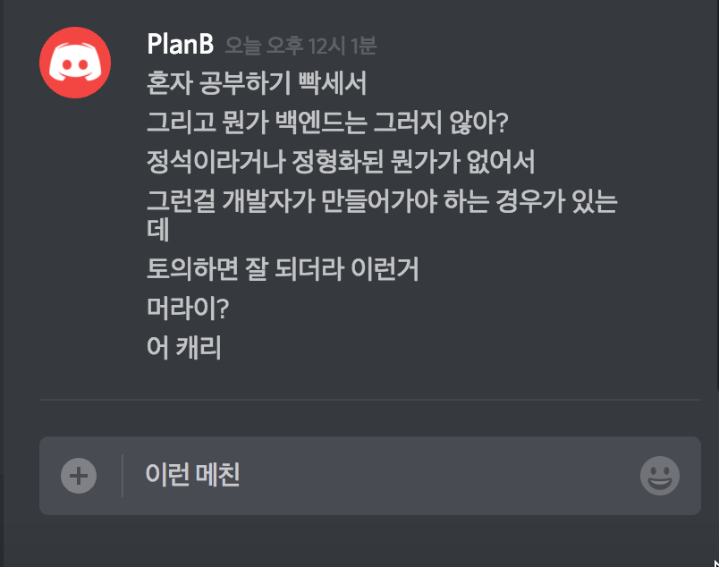

# Awesome-Backend-Study

## 동기

## 주제
- HTTP
- RESTful APIs
- Authentication
- Database
  - RDB
  - NoSQL
  - ORM/ODM
- Development
  - best practices
  - examples
  - frameworks
  - etc.
- Security
- Learning Curve
- Documentation
**추가 가능**

## 신청 방법 (모집중)
### Facebook
- [윤태훈](https://www.facebook.com/profile.php?id=100010455944037)
- [조민규](https://www.facebook.com/profile.php?id=100006735372513)
